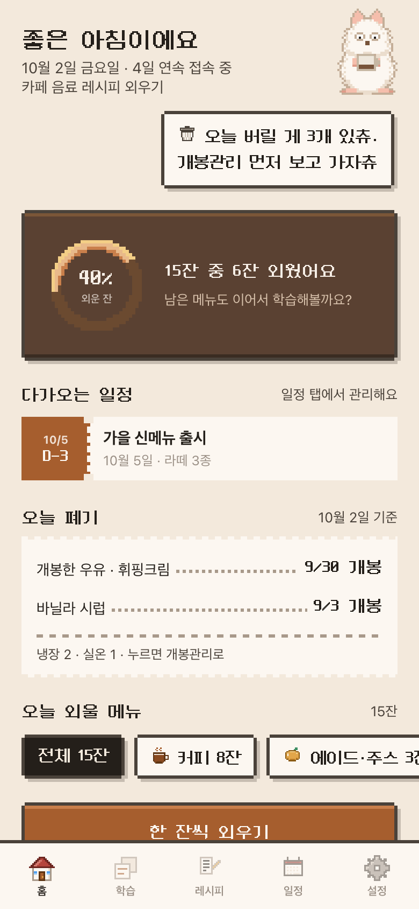
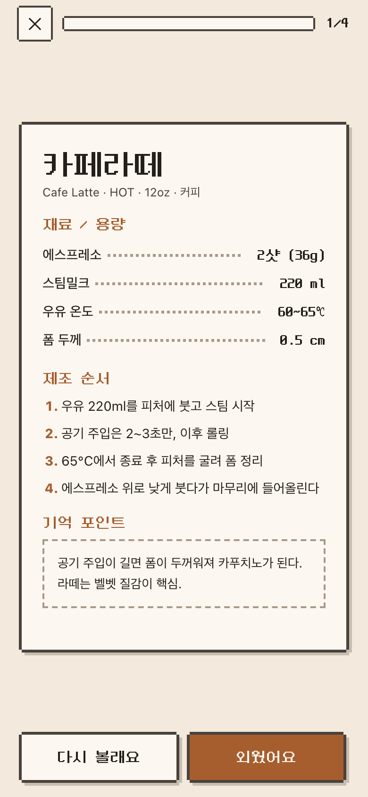
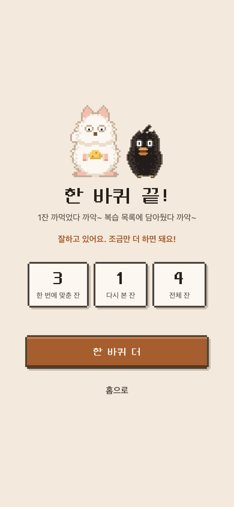
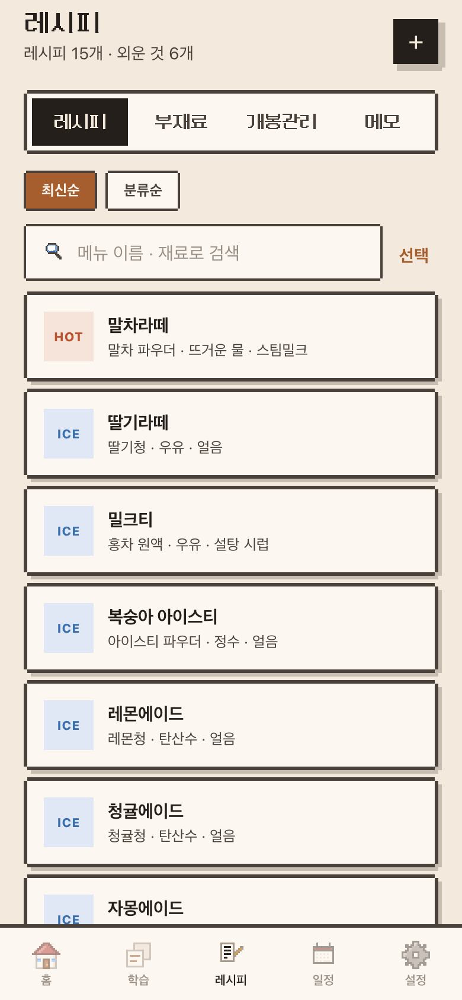
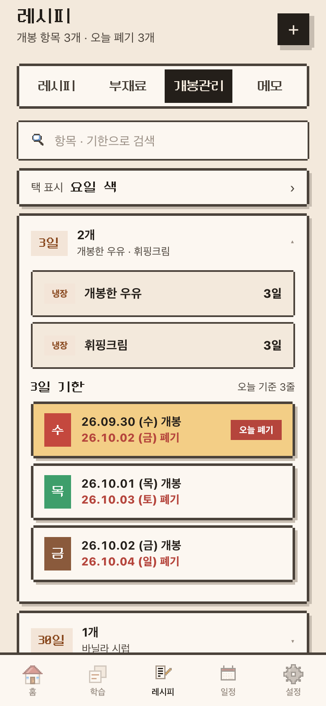
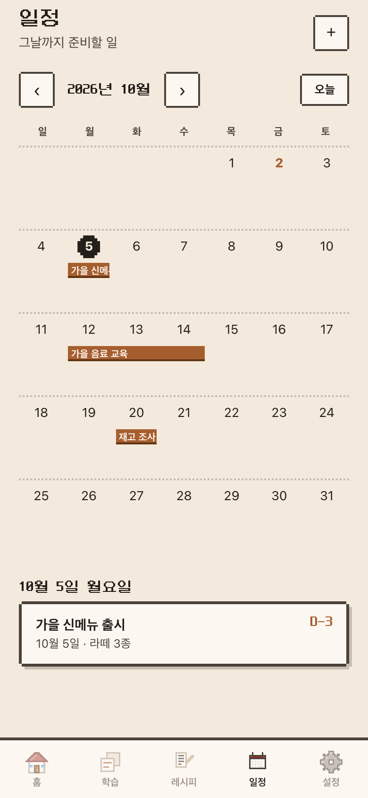

# 암기쥐

카페 음료 레시피를 카드로 외우는 iOS 앱. 쥐돌이가 옆에서 같이 외워 줍니다. Claude로 만들었습니다.

**[App Store 에서 받기](https://apps.apple.com/kr/app/id6817266810)** · 아이폰 · 아이패드 · 무료

<table>
  <tr>
    <td align="center"><br><sub>홈</sub></td>
    <td align="center"><br><sub>학습 카드</sub></td>
    <td align="center"><br><sub>한 바퀴 끝</sub></td>
  </tr>
  <tr>
    <td align="center"><br><sub>레시피</sub></td>
    <td align="center"><br><sub>개봉관리</sub></td>
    <td align="center"><br><sub>일정</sub></td>
  </tr>
</table>

<sub>앱(도트 화면) 모습입니다. 예시 레시피 15개로 찍었습니다.</sub>

## 지금 상태

- **iOS 앱** — 2026년 10월 [App Store](https://apps.apple.com/kr/app/id6817266810) 에 1.0 을 냈습니다(한국, 무료, 아이폰 · 아이패드).
  앱은 도트 화면(Neo둥근모 글꼴)으로 보입니다. 새 버전은 TestFlight 로 먼저 써 본 뒤 올립니다.
- **웹** — 2026년 10월에 닫았습니다. [amgijwi.com](https://amgijwi.com) 에는 안내 첫 화면(예전에 그 브라우저에서 쓰던 레시피를 백업 파일로 꺼내는 칸 포함),
  [도움말 · 문의](https://amgijwi.com/support.html), [개인정보 처리방침](https://amgijwi.com/privacy.html) 만 남아 있습니다.

> GitHub Pages 로 서빙하던 시절의 주소(`kmc1210.github.io/brewnote/`, `/amgijwi/`)는
> 2026-09-22 자로 내렸습니다.

## 기능

| 기능 | 설명 |
|---|---|
| **학습** | 카드 뒤집기 / 빈칸 채우기 두 가지 방식. 범위 안에서 외울 레시피만 골라서 돌립니다. 틀린 것은 복습 목록에 모입니다 |
| **레시피** | 직접 입력하거나, 사진 속 글자를 복사해 붙여넣으면 자동 정리. ICE/HOT 은 재료를 따로 적습니다 |
| **부재료** | 한 번 등록해 여러 메뉴에서 같이 씁니다 |
| **보관** | 안 쓰는 레시피는 지우지 말고 보관함으로 넘겨 학습에서 빼둡니다 |
| **개봉관리** | 개봉한 재료의 기한을 등록하면 기한별 개봉일 · 폐기일 표를 만들고 홈에서 오늘 폐기할 것을 알려줍니다. 택 표시는 매장 라벨에 맞춰 요일만 / 요일 색 / 번호 색 중에서 고르고 색도 직접 바꿉니다 |
| **일정** | 신메뉴 출시 같은 날을 달력에 걸어 두면 홈에 전표로 뜹니다. 기간 일정은 막대로 이어 그립니다. 앱에서는 그날 알림도 옵니다 |
| **쥐돌이** | 시간 · 상황에 맞춰 말을 걸고, 오늘 폐기가 있으면 비상등을 달고 뛰어다닙니다. 한 바퀴를 끝내면 치즈를 먹습니다 |
| **소리 · 진동** | 효과음과 배경음은 기본 꺼짐, 설정에서 켭니다. 앱은 카드 뒤집기 · 외웠어요 등에 짧은 진동이 있고 끌 수 있습니다 |
| **백업** | JSON 파일 하나로 내보내기 / 불러오기. 앱은 iOS 공유 시트로 "파일에 저장" · AirDrop 등으로 보냅니다 |
| **처음 쓰는 사람** | 앱을 처음 열면 다섯 장짜리 움직이는 가이드가 한 번 뜹니다. 설정 → 사용법 보기로 다시 봅니다 |

## 알아둘 점

- 레시피와 학습 기록은 **기기 안에만** 저장됩니다. 서버로 나가는 통신이 없습니다.
  CSP 의 `connect-src 'none'` 으로 웹뷰 · 브라우저가 이걸 강제합니다.
- 그래서 앱을 지우거나 기기를 바꾸면 사라집니다. **백업 파일을 만들어 두세요.**
- 예전 웹 버전에서 쓰던 레시피는 그 브라우저로 [amgijwi.com](https://amgijwi.com) 을 열면 백업 파일로 꺼낼 수 있습니다. 앱의 백업 불러오기로 가져옵니다.
- PIN 잠금은 훔쳐보기 방지용이지 암호화가 아닙니다.
- 소리는 음원 파일 없이 앱이 직접 만듭니다. 그래서 용량이 늘지 않고 CSP 도 그대로입니다.

## 구성

```
www/                   앱 본체. iOS 앱 번들에 그대로 들어갑니다. 사이트에는 처리방침 · 도움말 · 아이콘 · 글꼴만 올립니다
  index.html           마크업
  style.css            스타일 (웹 모습)
  dot.css              도트 화면. 모든 규칙이 html.dot 아래라 앱에서만 켜집니다
  fonts/               Neo둥근모 (OFL, 라이선스 파일 동봉)
  privacy.html         개인정보 처리방침
  support.html         도움말 · 문의 (App Store 지원 URL)
  js/                  앱 로직. 번들러 없이 이 순서대로 불러옵니다
    core.js            저장소 · 샘플 데이터 · 상태 · 부재료 공용 목록 · 진동
    sound.js           효과음 · 배경음 (전부 코드로 합성)
    mascot.js          쥐돌이 · 까마귀 도트 그래픽과 움직임, 대사
    shell.js           토스트 · 확인 모달 · 화면 전환
    home.js            홈, ICE/HOT 재료 두 벌 헬퍼
    cal.js             일정 달력 · 일정 알림 예약
    study.js           보관함 · 학습 · 빈칸 채우기 · 결과 화면
    list.js            목록 · 검색 · 부재료 · 개봉관리 · 택 표시 · 메모 · 상세 시트
    editor.js          사진 글자 분석 · 레시피/부재료 편집기
    settings.js        설정 · 백업 · PIN · 테마 · 소리 · 사용법
    guide.js           첫 실행 가이드 (앱만)
    closet.js          쥐돌이 옷장 · 치즈 (앱만)
    birthday.js        생일 축하 · 생일 알림 · 폭죽 (앱만)
    boot.js            저장 안정성 · 기기별 안내 · 시작
  apple-touch-icon.png
ios/                   iOS 껍데기 (WKWebView). 자세한 건 ios/README.md
  project.yml          xcodegen 설정. .xcodeproj 는 저장소에 넣지 않습니다
  Sources/             웹뷰 · 번들 스킴 처리기 · 알림 · 공유 시트 · 진동 · 앱 쪽 사본 통로
site/                  amgijwi.com 에 올리는 첫 화면(index.html)과 예전 레시피 꺼내기(rescue.js)
docs/
  screenshots/         README 스크린샷
  deploy.md            사이트 배포(S3 · CloudFront) · AWS OIDC
test/
  regression.js        실제 브라우저로 돌리는 회귀 테스트
  headers.js           배포된 사이트의 보안 헤더 검사
index.html             옛 단일 파일 (아래 참고)
```

### 앱이 웹 코드를 띄우는 방법

iOS 앱은 `www/` 를 번들에 담아 `amgijwi://app/index.html` 로 띄웁니다.
웹뷰가 뜰 때 `window.__amgijwiNative = true` 를 심고 `<html class="dot">` 을 붙여
도트 화면 · 카페 말투 · 첫 실행 가이드 · 진동 같은 앱 전용 모습을 켭니다. 이 표시 없이 브라우저로 열면 예전 웹 모습 그대로입니다(테스트 · 개발용).
알림 · 백업 내보내기 · 진동 · 레시피 사본 보관은 웹이 `window.webkit.messageHandlers` 로 앱에 부탁하고 앱이 iOS 기능으로 처리합니다
(`AlarmBridge` · `ShareBridge` · `HapticBridge` · `StoreBridge`). 빌드 · 서명 · TestFlight 업로드는 [ios/README.md](ios/README.md) 에 있습니다.

### 스크립트 로드 순서

번들러 없이 고전 script 태그로 불러옵니다. 전역을 그대로 쓰기 때문에
**`index.html` 의 로드 순서가 곧 의존 순서**입니다. `core` 가 먼저, `boot` 가 마지막입니다.
회귀 테스트가 `index.html` 의 목록과 `www/js` 의 파일이 일치하는지 확인합니다.

### 루트 index.html

옛 단일 파일입니다. 지금은 어디에도 서빙되지 않습니다.
옛 주소(`kmc1210.github.io`)의 브라우저 저장소에 남은 데이터를 꺼내야 할 때
Pages 를 잠깐 켜서 쓸 통로라 남겨둡니다.

### 바꾸면 안 되는 이름

코드 안의 `brewnote` 는 저장소 이름이 아니라 **앱 내부 식별자**라 바꾸지 않습니다.
저장 키 `brewnote.v1`, PIN 해시 salt, 백업 파일의 `app` 표시가 그렇습니다.
바꾸면 기존 레시피가 안 보이거나 PIN 잠금을 못 풉니다. 회귀 테스트가 이 값을 고정합니다.

## 테스트

```
npm ci
npx playwright install chromium
npm test
```

Chromium 을 띄워 `www/index.html` 을 열고, 부재료 마이그레이션 · 보관 필터 ·
참조 무결성 · 저장소 왕복 · 이스케이프 · CSP · 소리를 확인합니다.
앱 모드(`__amgijwiNative` · `html.dot`)로도 열어 도트 화면 · 일정 알림 · 백업 통로 · 진동 · 가이드를 확인합니다.
PR 을 올리면 GitHub Actions 가 같은 테스트(`ci.yml`)와 iOS 빌드(`ios.yml`)를 돌리고,
통과해야 main 에 머지합니다.

앱을 눈으로 보려면 `www/` 를 아무 정적 서버로 열면 됩니다(예: `python3 -m http.server -d www`).
번들러도 트랜스파일러도 없어서 따로 빌드할 것이 없습니다.

사이트 배포(S3 · CloudFront, 보안 헤더 확인, AWS OIDC 설정)는 [docs/deploy.md](docs/deploy.md) 에 있습니다.
